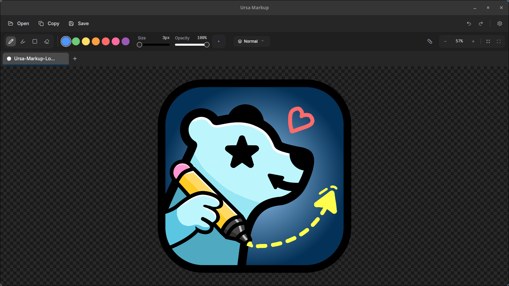
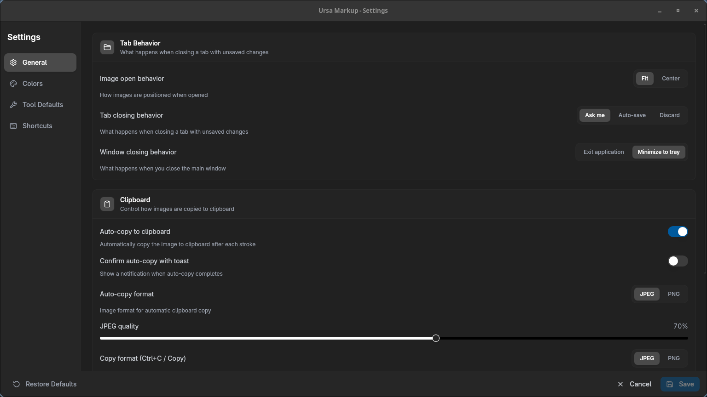
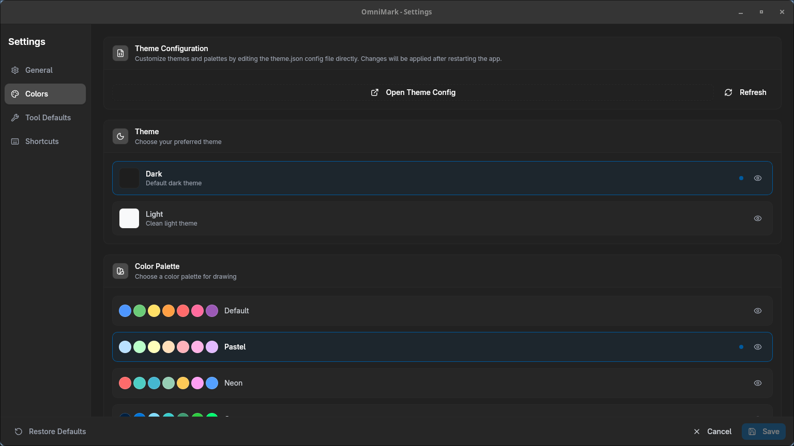
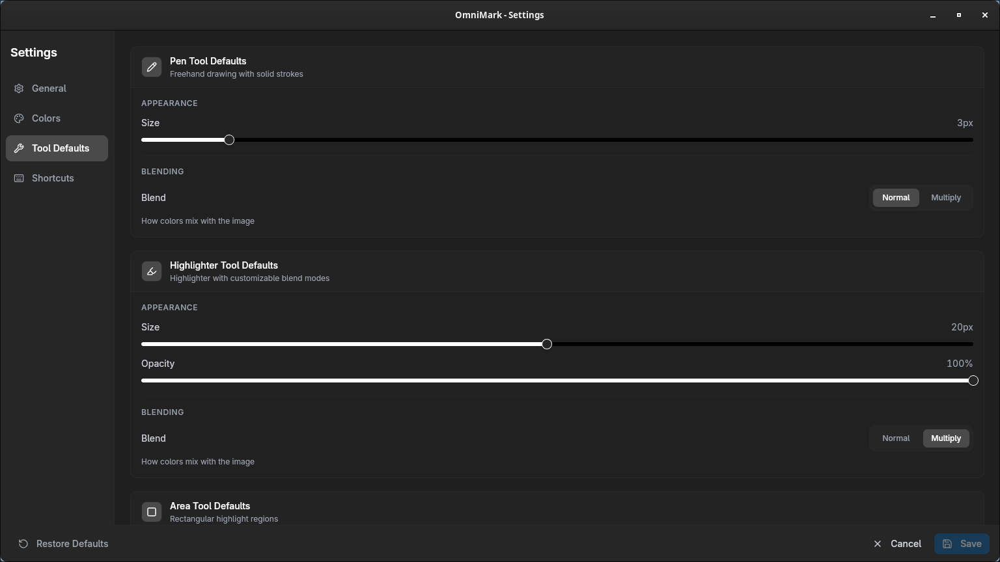
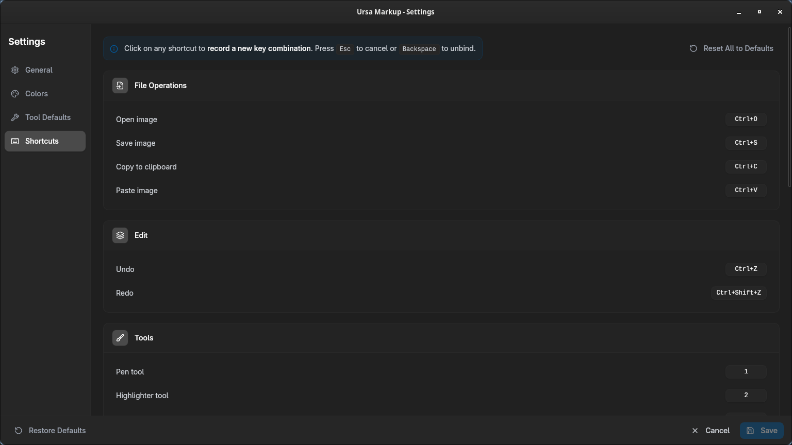

<div align="center">

# OmniMark

**A cross-platform image annotation tool inspired by the Windows Snipping Tool.**
Built with Tauri, React, and TypeScript.

[](https://github.com/BasicallyPolaris/omnimark/actions)
[](LICENSE)
[](https://github.com/BasicallyPolaris/omnimark/releases)



[**Download Latest Release**](https://github.com/BasicallyPolaris/omnimark/releases)

</div>

---

## Features

### 🎨 Drawing Tools

- **Pen Tool**: Freehand drawing with smooth anti-aliased strokes.
- **Highlighter Tool**: Highlighting with flat ends and transparency.
- **Area Tool**: Rectangle/rounded rectangle highlighting.
- **Eraser Tool**: Stroke/Object-based erasing.

### 🛠 Tool Settings

- Adjustable size and opacity per tool.
- Configurable border radius for area tools.
- Blend modes (Normal / Multiply).

### 🖼 Canvas Features

- **Zoom & Pan**: Smooth navigation with `Ctrl+Scroll` and drag gestures.
- **Fit/Center**: Quick hotkeys to frame your work.
- **Ruler Overlay**: Toggle (`Ctrl+R`) and rotate with scroll wheel for precision.

### 🚀 Productivity

- **Multi-Tab Support**: Work on multiple images simultaneously.
- **Auto-Copy**: Automatically copies the annotated image to clipboard after every stroke (configurable).
- **Undo/Redo**: Full history support per document.
- **Theming**: Fully customizable colors via `theme.json`.

## Configuration & Settings

OmniMark is highly customizable. You can tweak tool behaviors, themes, and shortcuts to match your workflow.

|                                    General Settings                                    |                                   Color Themes                                   |
| :------------------------------------------------------------------------------------: | :------------------------------------------------------------------------------: |
|     |  |
|                                   **Tool Defaults**                                    |                                  **Shortcuts**                                   |
|  |    |

## Installation

### Windows, macOS, Linux

Go to the [**Releases Page**](https://github.com/BasicallyPolaris/omnimark/releases) and download the installer for your operating system:

- **Windows**: `.exe` or `.msi`
- **macOS**: `.dmg` or `.app`
- **Linux**: `.deb` or `.AppImage`

> **Note**: As this is an open-source project, the binaries are currently unsigned. You may need to bypass standard security warnings (e.g., "Run Anyway" on Windows or Right Click > Open on macOS) to install.

## Keyboard Shortcuts

OmniMark is designed to be keyboard-driven. All shortcuts can be customized in **Settings → Shortcuts**.

<details>
<summary><strong>Click to view default Keybindings</strong></summary>

| Shortcut            | Action                    |
| ------------------- | ------------------------- |
| `Ctrl+O`            | Open image                |
| `Ctrl+S`            | Save image                |
| `Ctrl+C`            | Copy to clipboard         |
| `Ctrl+V`            | Open image from clipboard |
| `Ctrl+Z`            | Undo                      |
| `Ctrl+Shift+Z`      | Redo                      |
| `Ctrl+R`            | Toggle ruler              |
| `1`                 | Pen tool                  |
| `2`                 | Highlighter tool          |
| `3`                 | Area tool                 |
| `E`                 | Eraser tool               |
| `Ctrl+1` - `Ctrl+7` | Quick color presets       |
| `Ctrl+W`            | Close tab                 |
| `Ctrl+Tab`          | Next tab                  |
| `Ctrl+Shift+Tab`    | Previous tab              |
| `Ctrl+=` / `Ctrl+-` | Zoom in/out               |
| `Ctrl+0`            | Reset zoom to 100%        |
| `Ctrl+Alt+F`        | Fit image to window       |
| `Ctrl+F`            | Stretch to fill           |
| `Ctrl+Alt+C`        | Center image              |

</details>

### Build for Production

To create the installers locally:

```bash
bun run tauri build
```

- **User theme**: `~/.config/com.basicallypolaris.omnimark/theme.json` (created on first run)
- **Bundled default**: `src/lib/theme.json`

## Development

### Prerequisites

- [Bun](https://bun.sh/) (Preferred package manager)
- [Rust](https://rustup.rs/) (Required for Tauri backend)
- [Tauri Prerequisites](https://tauri.app/start/prerequisites/) (System dependencies for Linux/macOS)

### Setup

```bash
# 1. Clone the repo
git clone [https://github.com/BasicallyPolaris/omnimark.git](https://github.com/BasicallyPolaris/omnimark.git)
cd omnimark

# 2. Install dependencies
bun install

# 3. Run development server (Frontend + Rust backend)
bun run tauri dev
```

### Build for Production

To create the installers locally:

```bash
bun run tauri build
```

### Tech Stack

- **Core**: Tauri 2.x (Rust)
- **Frontend**: React 19 + TypeScript
- **Styling**: TailwindCSS 4 + ShadCN + BaseUI
- **State/Logic**: Custom HTML5 Canvas engine with Web Workers

## Contributing

Contributions are welcome! Please read [CONTRIBUTING.md](CONTRIBUTING.md) for details on our code of conduct, and the process for submitting pull requests.

## License

Distributed under the GPLv3 License. See `LICENSE` for more information.
